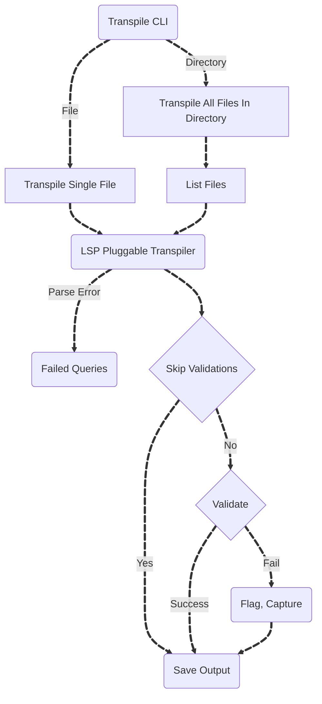

Lakebridge's transpilation module offers a pluggable mechanism for transpiling SQL files written in any supported source dialect into their equivalent in Databricks SQL.

### Design Flow:


When invoked with the following command line:

```bash
databricks labs lakebridge transpile --source-dialect snowflake --input-source /path/to/input --output-folder /path/to/output
```

Lakebridge will (recursively) scan `/path/to/input`, looking for `.sql` files, and for each such file it will produce a corresponding file (with the same relative path) under `/path/to/output`.

If for example we have the following `/path/to/input/foo/bar/silly.sql` file:

```sql
SELECT 1;
```

The transpiled file will be generated at `/path/to/output/foo/bar/silly.sql`:

```sql
/*
    Successfully transpiled from /path/to/input/foo/bar/silly.sql
*/
SELECT 1;
```

Notice how thee transpiler adds a header comment at the top of the transpile file. This header isn't very useful in such successful case, but it may come in handy when something went wrong during transpilation.

As a matter of fact, transpilation could fail for various reasons:
- the input code may contain constructs that have no equivalent in Databricks SQL,
- the selected transpilation plugin may be missing an implementation (or have a bug),
- less likely, the input code may be incorrect, making the transpilation plugin unable to parse it (Lakebridge is built on the assumption that the code you feed it is correct).

In such cases, the header comment will contain the list of errors encountered during transpilation in an attempt at making it easier for you to fix the transpiled code manually.

Let see an example:

```sql
/*
   Failed transpilation of /path/to/input/broken.sql

   The following errors were found while transpiling:
     - [3:3] Function GIBBERISH cannot be translated to Databricks SQL
*/
SELECT
  t1.name,
  GIBBERISH(t1.comment)
FROM
  t1;
```

Here the input code uses the (made up) `GIBBERISH` function that has no counterpart in Databricks SQL. The error is reported in the header comment with a specific position: `[3:5]` tells you that the problematic expression starts at the fifth character of the third line.

It is important to note that the transpiler isn't always able to know whether it can't translate a given function because such translation isn't possible or because it is lacking the implementation of said translation. When reviewing such errors, if you think that it is the latter case, please file a bug report/feature request.

## Plugins overview

Out of the box, Lakebridge comes with two transpilation plugins: Morpheus and BladeBridge. Each one has its own set of capabilities and levels of guarantee that we describe below.

### Morpheus

Morpheus aims at offering strong guarantees about the code it produces. A file successfully transpiled by Morpheus (without any error or warning) is supposed to yield a result on Databricks that's equivalent[^1] to the result of running the corresponding input file on the source platform.

As a consequence, whenever it finds itself unable to commit on such guarantee, Morpheus will emit either an error (when it knows that equivalent results cannot be guaranteed) or a warning (when it couldn't make sure that the guarantee holds). Being very conservative about this guarantee, Morpheus may emit warnings that are in fact false-negatives. In other words, a file that's successfully transpiled with warnings may still be correct and produce a result that's equivalent to its corresponding input on the source platform, but Morpheus was unable to guarantee it.

Internally, Morpheus is built upon a custom parser (generated from a carefully crafted ANTLR grammar). The input text is first parsed into an intermediate representation tree. That tree then undergoes a series of transformations where structures that are specific to the input dialect are transformed to their Databricks equivalent. Finally, the transformed tree is fed to a code generator that produces and formats the final Databricks SQL text.

Morpheus accumulates every error or warning encountered during the transformation and generation phases but continues processing the file. That way, even in the presence of errors, it keeps producing as much meaningful output as possible.

However, errors encountered during the parsing phase, because they prevent it from building the initial tree, make it unable to produce any meaningful output. In such a case, the output file will contain the original text, along with the parsing errors. Such parsing error are very unlikely to happen though and should be considered as a bug.

Finally, being built on the assumption that the input SQL is correct, Morpheus doesn't perform any semantical validation on the input code (such as type-checking). Therefore, the behaviour of code transpiled from a semantically incorrect input is unspecified.


[^1]: some statistical functions may be implemented on Databricks using an algorithm that slightly differs from the one used on the source platform, making the respective results non strictly identical to one another (although the differences wouldn't be statistically significant). Also, if no ordering is specified, rows may come in different order on Databricks and the source platform. In every other case, both results should be strictly identical.

### BladeBridge

**BladeBridge** is a flexible and extensible code conversion engine designed to accelerate modernization to Databricks. It supports a wide range of **ETL platforms** (e.g., Informatica, DataStage) and **SQL-based systems** (e.g., Oracle, Teradata, Netezza), accepting inputs in the form of exported metadata and scripts.

The converter generates **Databricks-compatible outputs** including:

- **Notebooks** – with ETL logic translated into code cells
- **Table & view definitions**
- **Stored procedures**
- **Spark SQL**
- **PySpark scripts**
- **Workflow definitions**

Internally, the execution is driven by **configuration files**, allowing users to define:

- Source/target mappings
- Naming conventions
- Transformation preferences
- Output formats

BladeBridge is fully **extensible** — new converters can be added, and the output structure can be **customized** to meet project-specific requirements.

Whether you're migrating a single job or thousands, BladeBridge delivers predictable, repeatable results optimized for the Databricks ecosystem.

More details about the BladeBridge converter [here](/docs/transpile/bladebridge_overview)

### Supported dialects

| Source Platform              | BladeBridge | Morpheus |   SQL    | ETL/Orchestration | dbt Repointing (Experimental) |
|:-----------------------------|:-----------:|:--------:|:--------:|:-----------------:|:------------------:|
| DataStage                    |  &#x2705;   |          | &#x2705; |     &#x2705;      |                    |
| Informatica (Cloud, PC)      |  &#x2705;   |          | &#x2705; |     &#x2705;      |                    |
| Netezza                      |  &#x2705;   |          | &#x2705; |                   |                    |
| Oracle (incl. ADS & Exadata) |  &#x2705;   |          | &#x2705; |                   |                    |
| Snowflake                    |             | &#x2705; | &#x2705; |                   |      &#x2705;      |
| SQL Server (incl. Synapse)   |  &#x2705;   |          | &#x2705; |                   |                    |
| Teradata                     |  &#x2705;   |          | &#x2705; |                   |                    |
